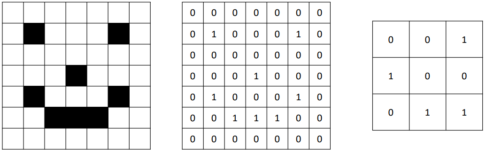
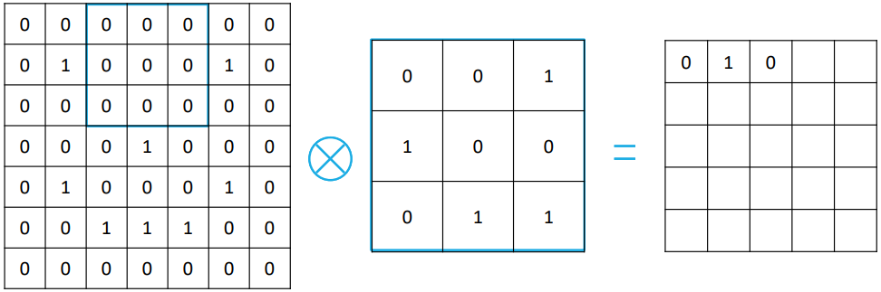
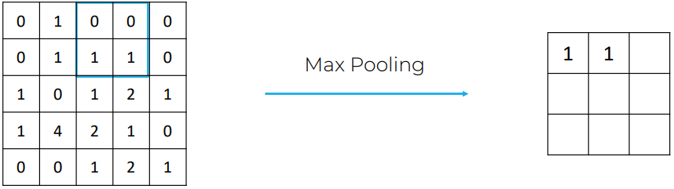
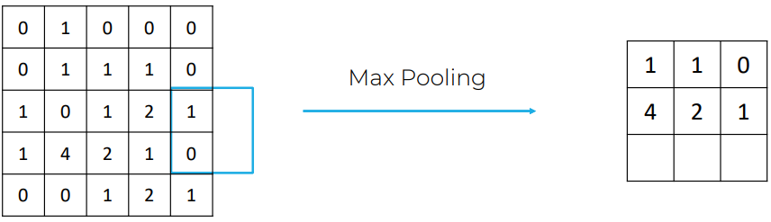
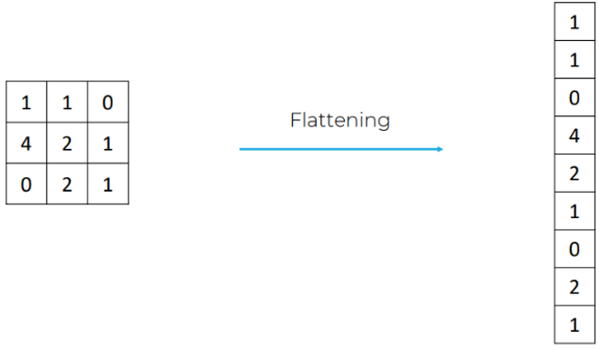
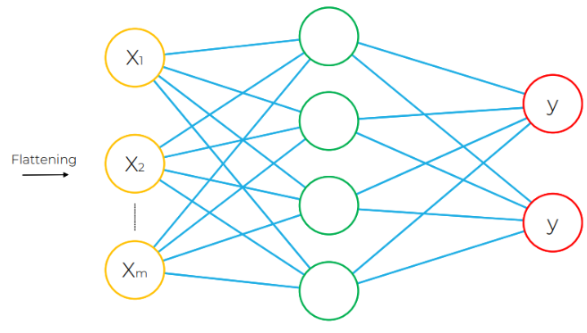
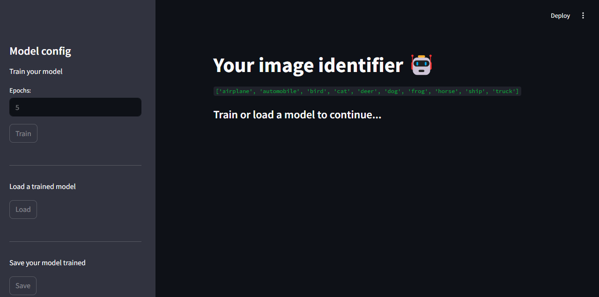
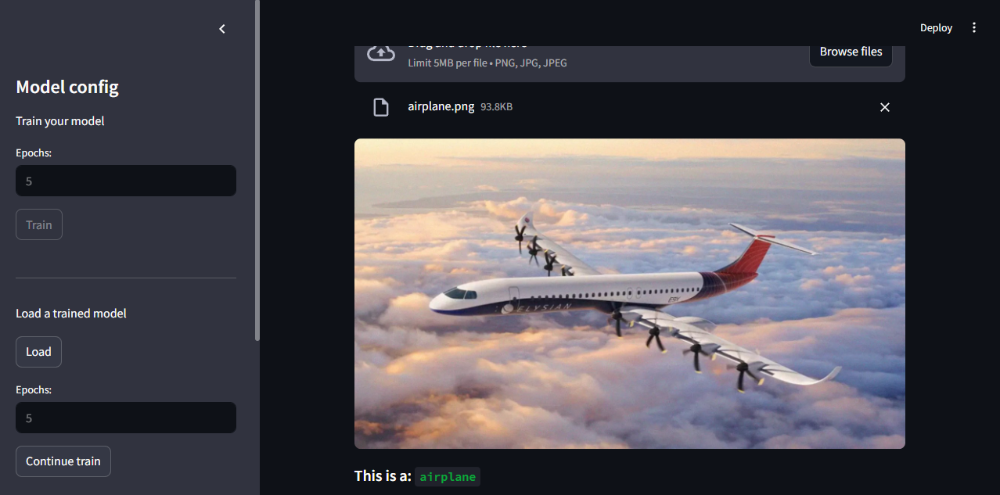
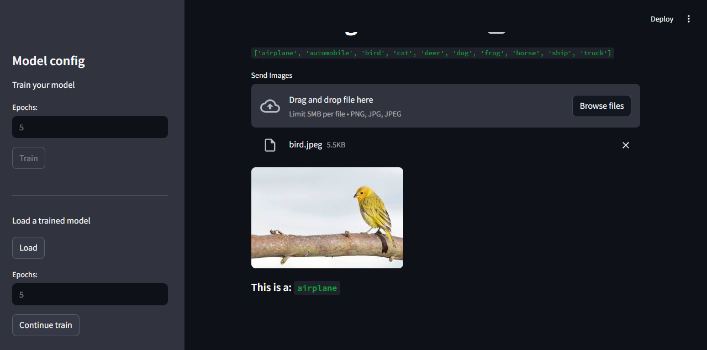
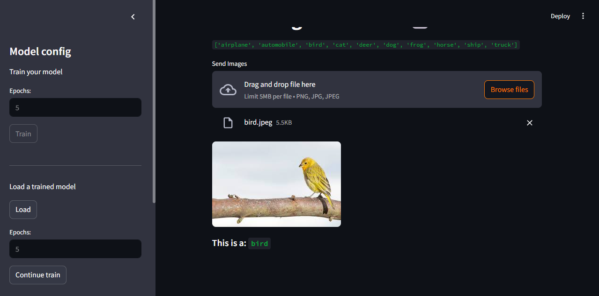

# 🖼️ PICTURE-CATEGORIZER-CNN

This project implements a CNN (Convolutional Neural Network) capable of classifying images using the CIFAR-10 base with a streamlit interface to interact with the model.

## ✨ Features

- **Image Classification**: Classifies images into 10 categories (airplane, automobile, bird, cat, deer, dog, frog, horse, ship, truck) using the CIFAR-10 dataset.
- **Interactive Interface**: Provides a user-friendly Streamlit interface for training, testing, and visualizing results.
- **Customizable Training**: Allows users to train the model with a configurable number of epochs and visualize training progress.
- **Real-Time Predictions**: Upload images and get real-time predictions with confidence scores.
- **Visualization of CNN Concepts**: Includes visual explanations of CNN components like convolution, pooling, and fully connected layers.
- **Regularization Techniques**: Implements Batch Normalization and Dropout to improve model performance and reduce overfitting.
- **Cross-Platform Compatibility**: Runs seamlessly on Linux, Windows, and macOS with Python and Streamlit.

## Resources

- [Python](https://www.python.org/downloads/)
- [PyTorch](https://pytorch.org/)
- [Streamlit](https://streamlit.io/)

<br>


<br/>

## 🌐 What is CNN?

A Convolutional Neural Network (CNN) is a type of artificial neural network designed to process data with a grid-like structure, such as images. Inspired by the animal visual cortex, it uses convolutional layers to detect hierarchical spatial patterns in the inputs. These layers apply filters that learn to extract relevant features, such as edges, textures, and objects. Pooling layers reduce dimensionality, while fully connected layers perform the final classification. CNNs are widely used in computer vision, including object recognition, semantic segmentation, and facial detection.

## 👉🏻 Main steps

- **Convolution**:

  - This is the fundamental step. A small filter (kernel) slides over the input image, performing a dot product operation between the filter values ​​and the corresponding values ​​in the image.
  - Multiple different filters are typically applied to the same input image, generating multiple feature maps, each learning different aspects of the image.

<p align="center">
  
  
</p>

- **Pooling**:

  - The pooling step reduces the dimensionality of the feature maps, making the network more robust to small variations in the input (translation, rotation, scale) and reducing the number of parameters to be learned.
  - The most common pooling operations are Maximum Pooling, which selects the maximum value within a window, and Average Pooling, which calculates the average of the values ​​within the window.

<p align="center">
  
  
</p>

- **Flattening**:
  - After applying multiple convolutional and pooling layers, the resulting feature maps are multidimensional structures (width, height, number of filters).
  - The Flattening step takes these feature maps and turns them into a single long one-dimensional vector. Basically, all the values ​​from the feature maps are "stacked" into a single column.

<p align="center">
  
</p>

- **Full connected**:
  - After several layers of convolution and pooling (which may repeat), the resulting feature maps are flattened (transformed into a one-dimensional vector).
  - This vector is then fed into one or more fully connected layers, which function similarly to the layers of a traditional neural network (Multilayer Perceptron - MLP).
  - The last fully connected layer usually has a number of neurons equal to the number of classes you want to classify.
  - An activation function such as **softmax** is often used in the output layer to produce probabilities for each class.

<p align="center">
  
</p>

## 🪙 Concepts

### Batch Normalization

Batch Normalization normalizes the activations of each mini-batch, stabilizing training and accelerating network convergence. It reduces the "internal covariate shift" problem, allowing for the use of larger learning rates and making training more robust to poor initializations. It also acts as a regularizer, reducing overfitting. In short, it makes the training of neural networks more efficient and stable.

### Dropout

Dropout is a regularization technique that randomly deactivates a percentage of neurons during training. This prevents neurons from becoming overly dependent on others, forcing the network to learn more robust and generalizable representations. By reducing co-adaptation, Dropout helps mitigate overfitting, improving the model's performance on unseen data.

## 🛠️ Instalação

Clone o repositório:

```bash
git clone https://github.com/ganascimento/picture-categorizer-cnn.git
cd picture-categorizer-cnn
```

## 🧪 Test/Run Project

Make sure you have the required packages installed:

- PyTorch
- Streamlit
- Streamlit-extras

Enter the folder `src` and run command:

```cmd
streamlit run main.py
```

## 🌟 Examples

### Default screen, without any trained or loaded models

<p align="center">
  
  <br>
  <em>Example: base system view</em>
</p>

<br/>

### Train/test model - 5 Epochs

Model training with 5 epochs and tests with airplane and bird photos

<div style="display: flex; justify-content: center; gap: 10px">
  <p align="center">
    
    <br>
    <em>Example: airplane classification</em>
  </p>
  <p align="center">
    
    <br>
    <em>Example: bird classification wrong</em>
  </p>
</div>

<br/>

### Train/test model - 10 Epochs

Model training with 10 epochs and tests with airplane and bird photos

<div style="display: flex; justify-content: center; gap: 10px">
  <p align="center">
    
    <br>
    <em>Example: airplane classification</em>
  </p>
  <p align="center">
    
    <br>
    <em>Example: bird classification</em>
  </p>
</div>
